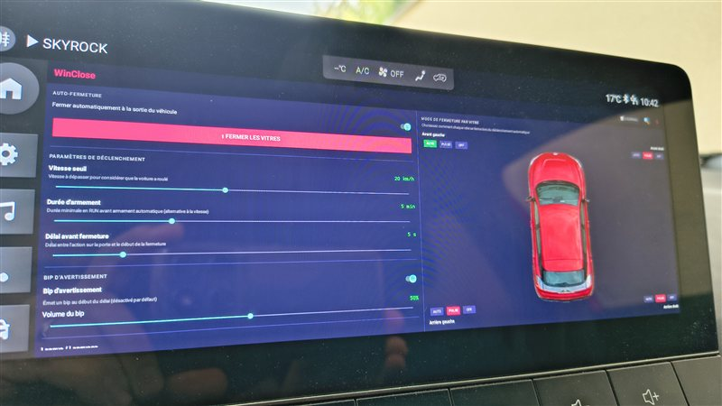

# WinClose - Automatic Window Closing for MG4

Automatic window closing application for MG4 electric vehicles running Android Automotive OS (AAOS). Seamlessly closes all windows when you exit the vehicle—perfect for parking in unpredictable weather.



## Features

- 🪟 **Automatic Window Closing** – Windows close automatically when you park and exit the vehicle. Fully configurable: choose a closing mode for each window independently, or disable specific windows entirely to prevent them from ever closing automatically.
  - **AUTO**: Sends the native automatic close command (requires a window motor with position sensor — typically luxury trim)
  - **PULSED**: Holds the close command for a configurable duration — works on all trims
  - **OFF**: Window is excluded from automatic and manual closing; it will never be commanded closed by the app
- 🎯 **Configurable Triggers**:
  - **Speed Threshold** (5–40 km/h): Minimum speed to "arm" the system
  - **Arming Duration** (1–15 min): Minimum driving time to arm without reaching speed threshold
  - **Closing Delay** (0–30 sec): Delay between door opening and window closing
- 🔔 **Configurable Warning Beep** – Optional audio alert during the closing delay countdown, with adjustable volume (0–100 %)
- 🌐 **Bilingual UI** – Supports French and English with one-tap language switching
- 🎮 **Manual Close Button** – Manually close windows with a 5-second pulse
- 📊 **Real-Time Activity Log** – Monitor system events in real-time
- 🔋 **Foreground Service** – Persistent background operation with wake lock
- 🔐 **System Integration** – Deep integration with SAIC vehicle services via Binder/IPC

## How It Works

### Trigger Logic
1. **Monitoring**: App monitors vehicle speed via SAIC API continuously
2. **Arming**: System arms when:
   - You exceed the speed threshold **OR**
   - You drive longer than the configured arming duration
3. **Trigger**: Upon arrival, when you:
   - Shift to **Park (P)**
   - Open the **driver door**
   - After the configured **closing delay** → only windows set to **AUTO** or **PULSED** close automatically; windows set to **OFF** are ignored

### Architecture
- **WindowHardware**: Core hardware interface using Katman4/Katman5 Binder services and CarStateClient for real-time state
- **WindowService**: Background foreground service monitoring ignition state and triggering window closing
- **Settings**: Persistent configuration storage with SharedPreferences
- **MainActivity**: Bilingual UI with settings dialog and activity log

## Installation

### Prerequisites
- MG4 with Android Automotive OS (tested on SWI69, others untested)
- ADB (Android Debug Bridge) installed
- USB debugging enabled on the head unit (via service menu)
- AOSP test platform signature trust (standard on MG4 fleet)

### Option A — Direct APK install (recommended)

1. Download **[winclose-signed.apk](https://github.com/Skittle6938/winclose/releases/latest/download/winclose-signed.apk)**
2. Copy it to a USB stick and plug it into the head unit's USB port
3. Open the APK with the built-in file manager to install it

### Option B — ADB over USB

ADB is disabled by default on the MG4 head unit. You need to enable it first using **ADB_util**, a tool developed by Leon Kerman:

> [XDA thread — MG4 Electric AAOS 9 playing (and possibly other MG models)](https://xdaforums.com/t/mg4-electric-aaos-9-playing-and-possibly-other-mg-models.4697712/post-90591053)

Once USB debugging is enabled:

1. Connect a USB cable between your PC and the head unit
2. Install the APK:
   ```bash
   adb install -f winclose-signed.apk
   ```
   The `-f` flag is required to replace/upgrade the app when it shares the platform signature.

3. Launch WinClose from the app launcher and enable the **Auto-close** toggle

## Usage

### Main Screen
- **Auto-close Toggle**: Enable/disable automatic window closing
- **Close (PULSE 5s) Button**: Manually trigger a 5-second pulse to all windows
- **Clear Log Button**: Clear the activity log
- **⚙ Settings Button**: Configure thresholds and per-window modes
- **ℹ Info Button**: View feature documentation
- **Activity Log**: Real-time events and system status

### Settings
- **Speed Threshold**: Minimum speed to arm the system (default: 20 km/h)
- **Arming Duration**: Minimum RUN time for auto-arm (default: 5 minutes)
- **Closing Delay**: Delay before closing after door opens (default: 5 seconds)
- **Warning Beep**: Enable/disable an audible beep every second during the closing delay; adjust volume from 0 to 100 %
- **Per-Window Mode**: Choose AUTO, PULSE, or OFF for each of the 4 windows independently. Windows set to OFF are completely excluded — they will not close automatically or respond to the manual close button
- **Language**: Toggle between French and English
- **Reset Button**: Restore all settings to defaults

## Configuration Reference

| Setting | Min | Default | Max | Unit |
|---------|-----|---------|-----|------|
| Speed Threshold | 5 | 20 | 40 | km/h |
| Arming Duration | 1 | 5 | 15 | minutes |
| Closing Delay | 0 | 5 | 30 | seconds |
| Beep Volume | 0 | 50 | 100 | % |

## System Behavior

- **Cooldown**: 60-second cooldown between consecutive close operations to prevent repeated triggering
- **Auto-Rearm**: System automatically re-arms after each close cycle in the same session
- **Foreground Service**: Runs continuously in background with persistent notification
- **Wake Lock**: Maintains partial wake lock to ensure timely trigger detection
- **Service Restart**: Automatically restarts at device boot

## Technical Details

### Binder/IPC Services Used
- **Katman4/Katman5**: Low-level window control via SAIC firmware
- **CarStateClient**: Real-time vehicle state (gear, parking brake, door sensors)
- **CarGeneralClient**: Current vehicle speed
- **CarAdapterClient**: Service discovery and initialization

### Window Control Modes
- **AUTO (Code 3)**: Sends native automatic close command
- **PULSED (Code 1)**: Holds close command for configured duration (5-30 seconds)
- **OFF**: No action on this window

### Area Mapping
- **FL (0)**: Front Left (driver side)
- **FR (1)**: Front Right (passenger side)
- **RL (2)**: Rear Left
- **RR (3)**: Rear Right

## Compatibility

- **Tested**: MG4 AAOS SWI69
- **Expected Compatible**: MG4 units with standard AOSP test keys
- **Not Compatible**: Older MG4 models with different vehicle service architecture

## Known Limitations & Tested Without Success

The following approaches were explored but could not be implemented due to hardware or API constraints:

- **Closing windows at vehicle lock** – Triggering on the lock event was attempted, but the windows lose power as soon as the car locks. Any close command sent at or after that moment has no effect; the motors simply do not respond.

- **Triggering on door close instead of door open** – Closing windows once the driver has shut the door behind them (rather than when they first open it) would be a cleaner UX. However, no reliable door-close event was found in the SAIC vehicle APIs available to third-party apps. The current implementation triggers on door open and uses a configurable delay to approximate the same outcome.

## Troubleshooting

### App not closing windows
1. **Check system activation**:
   - Enable "Auto-close" toggle in main screen
   - Watch the activity log for trigger events
   - Verify speed threshold is reached or arming duration elapsed

2. **Check per-window configuration**:
   - Go to ⚙ Settings → Per-window closing mode
   - Ensure at least one window is set to AUTO or PULSE
   - Verify window mode color indicates selection (green=AUTO, red=PULSE, gray=OFF)

3. **Test manual close**:
   - Click "⬆ Close windows" button
   - Watch activity log for pulse events
   - If manual close works, auto-trigger may need configuration adjustment

4. **Check permissions**:
   - Ensure app has required permissions: WAKE_LOCK, FOREGROUND_SERVICE
   - Monitor Android system logs for permission errors

### Windows not responding
- Try different per-window modes (AUTO vs PULSE)
- Some MG4 units may have hardware quirks; PULSE mode is most reliable

## Development

### Build Requirements
- Android Studio with Android Automotive SDK
- Kotlin 1.8+
- Min SDK: 30 (Android Automotive 11)
- Target SDK: 34

### Build Instructions
```bash
./gradlew assembleRelease
```


## License

[Add appropriate license - GPL/MIT/Apache/etc.]

## Contributing

Pull requests and issue reports welcome! Please include:
- MG4 firmware version (check vehicle settings)
- Detailed description of unexpected behavior
- Steps to reproduce issues
- Activity log output (if applicable)

## Support & Community

For issues, questions, or compatibility reports:
- Open an [Issue](../../issues) on GitHub
- Check existing issues for common problems
- Share your MG4 firmware version for compatibility tracking

## Disclaimer

This application interacts with vehicle hardware and services. Use at your own risk. The developer assumes no liability for damage to vehicle electronics, unexpected vehicle behavior, or safety issues. Always verify window operation in normal mode before relying on automatic closing.

## Changelog

### v1.2 — Window position reading & UI refresh
- **Window position read before closing**: for windows in AUTO mode (luxury versions with position sensor), the current position is logged and already-closed windows are skipped automatically. Windows in PULSED mode (standard versions without sensor) are always commanded closed as a safe fallback.
- **Removed "door-close" trigger option**: door-close detection is not yet available via the SAIC APIs; the system now uses door-open exclusively.
- **New car graphic**: replaced the simplified vector silhouette with a real top-down photo of the MG4, displayed full-size behind the 4 window panels.

### v1.1 — Warning beep, redesigned UI
- **Configurable warning beep**: optional audible beep during the closing delay countdown, volume adjustable from 0 to 100 %.
- **UI redesign**: all settings are now on the main screen (no separate settings dialog); the activity log is accessible via a dedicated button.
- **Delay trigger**: added option to trigger the closing delay on door open (default) or door close.

### v1.0 — Initial release
- Automatic window closing on parking + door open
- Speed threshold, arming duration and closing delay configurable
- Per-window mode (AUTO / PULSED / OFF)
- French / English bilingual UI
- Real-time activity log

---

**WinClose** — Keeping your MG4 dry, one automatic window at a time. 🚗💨
